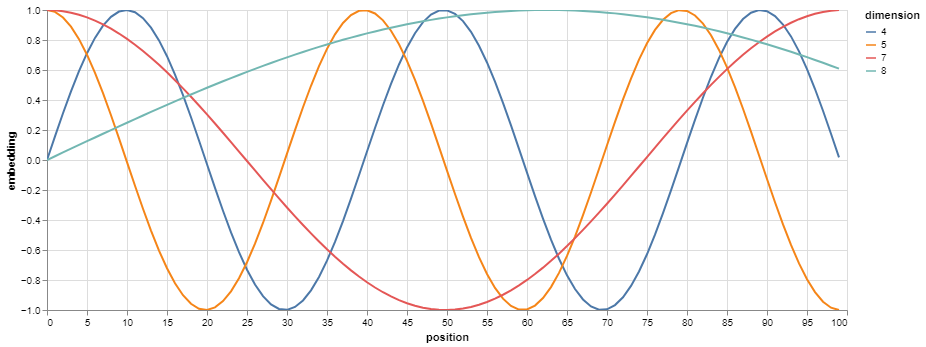
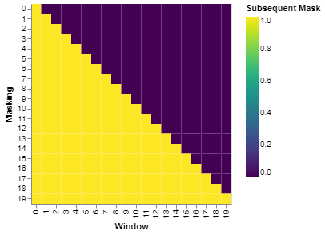

# Attention Is All You Need - Implementation

This repository contains a PyTorch implementation of the Transformer model as described in the paper *"Attention Is All You Need."* The implementation includes various components of the model, such as multi-head attention, encoder-decoder architecture, and positional encoding.

## Table of Contents

- [Features](#features)
- [Installation](#installation)
- [Usage](#usage)
- [Model Architecture](#model-architecture)
- [Visualizations](#visualizations)
- [Contributing](#contributing)

## Features

- Implementation of the Transformer model.
- Multi-head attention mechanism.
- Encoder and decoder with layer normalization and dropout.
- Visualizations of positional encoding and masking.

## Installation

1. Clone the repository:

   ```bash
   git clone https://github.com/RushabhMehta/transformer-architecture.git
   cd transformer-architecture
   ```

2. Create a virtual environment and activate it:

   ```bash
   python -m venv env
   source env/bin/activate  # On Windows use `env\Scripts\activate`
   ```

3. Install the required packages:

   ```bash
   pip install -r requirements.txt
   ```

## Usage

1. To run inference tests on the model, execute the following script:

   ```bash
   python inference_test.py
   ```

2. Modify the parameters in `inference_test.py` as needed for different test scenarios.

## Model Architecture

The architecture is composed of the following components:

- **Embedding Layer**: Converts input tokens into dense vector representations.
- **Positional Encoding**: Adds positional information to the embeddings.
- **Encoder**: Consists of multiple encoder layers, each with self-attention and feed-forward sub-layers.
- **Decoder**: Similar to the encoder, but also attends to the encoder's output.
- **Multi-head Attention**: Allows the model to focus on different parts of the input sequence simultaneously.
- **Feed-Forward Network**: Applies a two-layer feed-forward network to each position independently.

## Visualizations

### Positional Encoding



*Visual representation of positional encoding used in the model.*

### Subsequent Mask



*Visualization of the masking used in the decoder to prevent attending to future tokens.*

## Contributing

Contributions are welcome! Please feel free to submit a pull request or open an issue.
